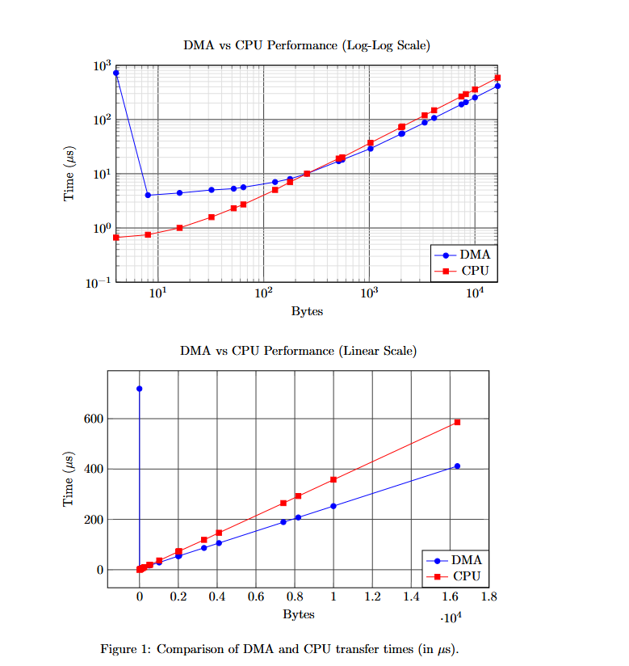

## Introduction
The goal of this document is to present the analysis of the results of the comparison between CPU and DMA.

## Testing Methodology
* The DMA was tested by requesting a data transfer and putting the CPU to sleep to reduce congestion on the bus. A DMA transfer-complete callback was used to notify the CPU about the end of the transfer. The DMA was configured to use single burst mode during the transfer.
* The CPU was tested by requesting a data transfer using `memcpy`.
* The transfer time was measured using a logic analyzer and Sigrok. An LED pin was set high before starting the transfer and then set low when the transfer completed.

## Performance Visualization: Logarithmic vs. Linear

**Raw Data: DMA vs CPU Performance (µs)**

| Bytes | DMA (µs) | CPU (µs) |
|------:|---------:|---------:|
| 4 | 719 | 0.666 |
| 8 | 4 | 0.749 |
| 16 | 4.4 | 1.001 |
| 32 | 5 | 1.582 |
| 52 | 5.3 | 2.3 |
| 64 | 5.6 | 2.7 |
| 128 | 7 | 5 |
| 177 | 8 | 7 |
| 256 | 10 | 10 |
| 512 | 17 | 19 |
| 555 | 18 | 20 |
| 1024 | 29 | 37 |
| 2000 | 54 | 72 |
| 2048 | 55 | 74 |
| 3333 | 87 | 119 |
| 4096 | 106 | 147 |
| 7421 | 189 | 265 |
| 8192 | 208 | 293 |
| 10000 | 253 | 358 |
| 16384 | 412 | 586 |

## Explanation of Results

### Speed Comparison
* We can observe that the CPU is faster than DMA for small buffer sizes (< 256 bytes); after that threshold, DMA starts becoming faster. The reason for this is that DMA is akin to a hardware state machine that takes action based on its current state and register values. The CPU, however, is much more complicated hardware that has to perform complex operations, fetching both data and instructions (both of those memories are on the same bus), while DMA just fetches data directly from memory. This explains why DMA wins for larger buffer sizes. 
* The slower times for small data transfers using DMA can be attributed to the cold start and initialization overhead required to configure the DMA registers before the transfer can begin.

### Outlier
In our data, we can notice one significant outlier for DMA. A 4-byte DMA request takes much longer than a transfer for 8 bytes. At first, I thought this might be the result of a one-time DMA initialization penalty, resulting in a slower first request. However, I repeated this specific measurement after performing all other measurements for the DMA and CPU, and it still returned an unnaturally long transfer time. Unfortunately, I wasn't able to pinpoint the exact cause for this behavior. Perhaps there is a large overhead if the DMA isn't used for a "long" time.
